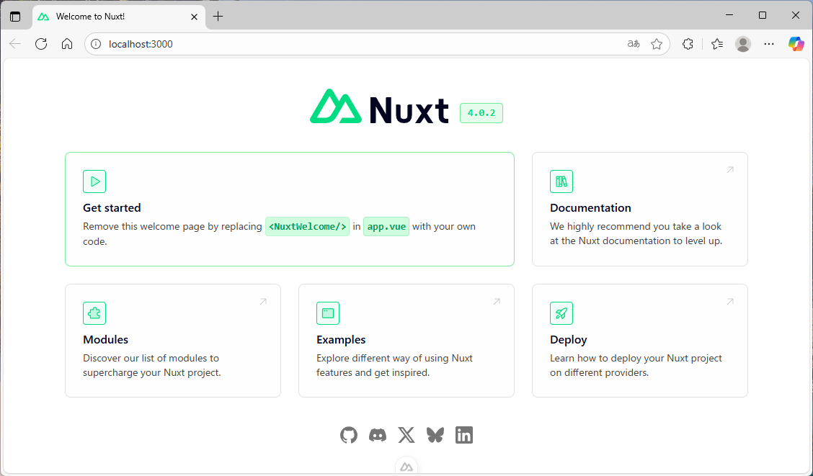

# 始め方１： Nuxt プロジェクトの作成

## Node.JS のバージョン確認

Node.JS がインストール済みとします。  
カレントディレクトリーの例： 📁 `C:\Users\muzud\OneDrive\ドキュメント\GitHub\vue-nuxt-webapp-sample`  

（パワーシェルではなく、）コマンドプロンプトで以下を打鍵します。  

```shell
node -v
        v22.16.0
```

## npx を使って、 Nuxt をインストール

```shell
npx nuxi@latest init .
```

バージョンを尋ねられる。 `y` で進む。  

📁 `C:/Users/muzud/OneDrive/ドキュメント/GitHub/vue-nuxt-webapp-sample` ディレクトリーに上書きするか尋ねられる。 `Override its contents` で進む。  

パッケージ・マネージャー（package manager）をどれにするか尋ねられる。 `pnpm` を選ぶ。  

Git リポジトリー（git repository）を初期化するか尋ねられるので、 `Yes` を選ぶ。  

公式モジュールをインストールするか尋ねられるので、とりあえず `No` を選ぶ。  

```plaintext
✨ Nuxt project has been created with the v4 template. Next steps:
 › Start development server with pnpm run dev
```

これで、以下のようなフォルダー構成が作られている。  

```plaintext
📁 .nuxt
📁 app
📁 node_modules
📁 public
📄 .gitignore
📄 nuxt.config.ts
📄 package.json
📄 pnpm-lock.yaml
📄 README.md
📄 tsconfig.json
```

## とりあえず、ウェブサーバーを開発モードで起動

```shell
pnpm run dev
        > nuxt-app@ dev C:\Users\muzud\OneDrive\ドキュメント\GitHub\vue-nuxt-webapp-sample
        > nuxt dev

        Nuxt 4.0.2 with Nitro 2.12.4                                                                 nuxi 16:39:33
                                                                                                        16:39:33
        ➜ Local:    http://localhost:3000/
        ➜ Network:  use --host to expose

        ➜ DevTools: press Shift + Alt + D in the browser (v2.6.2)                                       16:39:35

        ✔ Vite client built in 44ms                                                                      16:39:36
        ✔ Vite server built in 91ms                                                                      16:39:37
        ✔ Nuxt Nitro server built in 1568ms                                                        nitro 16:39:38
        ℹ Vite client warmed up in 3ms                                                                   16:39:38
        ℹ Vite server warmed up in 47ms 
```

[http://localhost:3000/](http://localhost:3000/) を開く。  

  
